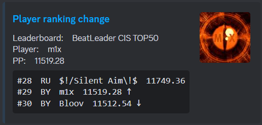

# Overview

This is a discord bot for tracking the scores of specified users on the BeatLeader board and posting embed messages in the specified channel.

The score will be published when one of the conditions is met:

- top 10 score on the ranked map;
- top 8 score of personal pp scores;
- top 100 score on the ranked map and top 25 pp score of personal scores.

Also bot can monitoring change ranking of top N players of county or some countries.

## General slash commands:

- `/link [userid]` -> link a player's account to monitoring.
- `/unlink [userid]` -> unlink a player's account from monitoring.
- `/bsr [mapcode]` -> show map details from a BeatSaber. 

### Other commands:

- `!bsr [mapcode]` -> same as /bsr

# Installation

This bot runs on [node.js](https://nodejs.org).

1. Install [node.js](https://nodejs.org/en/download/)
2. Run `npm install` and make sure it succeeds
3. Set up your `config.json`:
- set `BOT_TOKEN` -> Discord bot TOKEN
- set `clientId` -> Discord APPLICATION ID
- set `guildId` -> Discord Guild ID
- set `channelId` -> Discord Channel ID - channel where scores messages will be posted
4. Run `node deploy-commands.js`
5. Run `node .` to run the bot!

# About country monitoring:

By default, monitoring of the top 50 players from the CIS countries is set and monitoring is disabled. 
Important variables:
- `ENABLE_COUNTRY_RANKCHANGE_MON` -> enable/disable monitoring
- `RANK_TOP` -> number of ranks for monitoring
- `RANK_TOP_COUNTRIES` -> list of countries to monitoring
- `NAME_RANK_TOP` -> custome leaderboard name for message 

Preview of score message:

Preview of map details message:

Preview of map details message:

