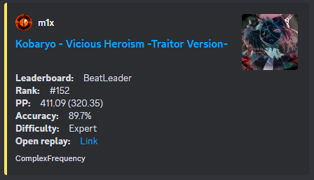
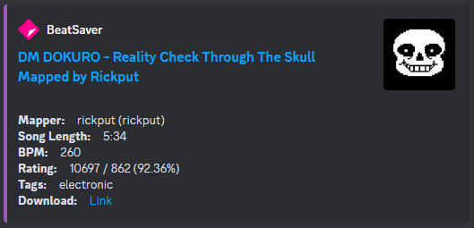

# Overview

This is a discord bot for tracking the scores of specified users on the BeatLeader board and posting embed messages in the specified channel.

The score will be published when one of the conditions is met:

- top 10 score on the map;
- top 8 score of personal scores;
- top 100 score on the map and top 25 score of personal scores.

## General slash commands:

- `/link [userid]` -> link a player's account to monitoring.
- `/unlink [userid]` -> unlink a player's account from monitoring.
- `/bsr [mapcode]` -> show map details from a BeatSaber. 

### Other commands:

- `!bsr [mapcode]` -> same as /bsr

# Installation

This bot runs on node.js.

1. Install node.js
2. Run `npm install` and make sure it succeeds
3. Set up your `config.json`:
- set `BOT_TOKEN` -> Discord bot TOKEN
- set `clientId` -> Discord APPLICATION ID
- set `guildId` -> Discord Guild ID
- set `channelId` -> Discord Channel ID - channel where scores messages will be posted
4. Run `node deploy-commands.js`
5. Run `node .` to run the bot!

Preview of score message:

Preview of map details message:

